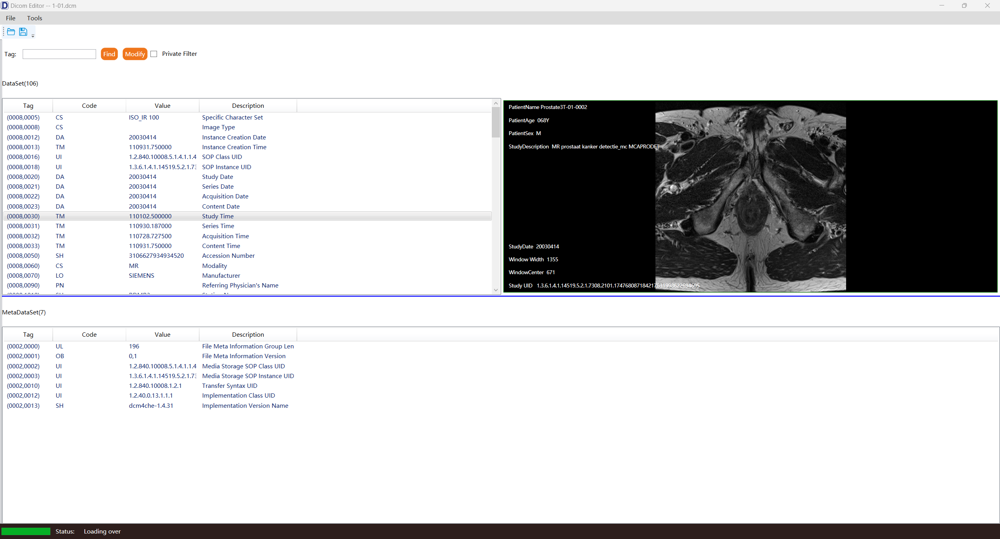
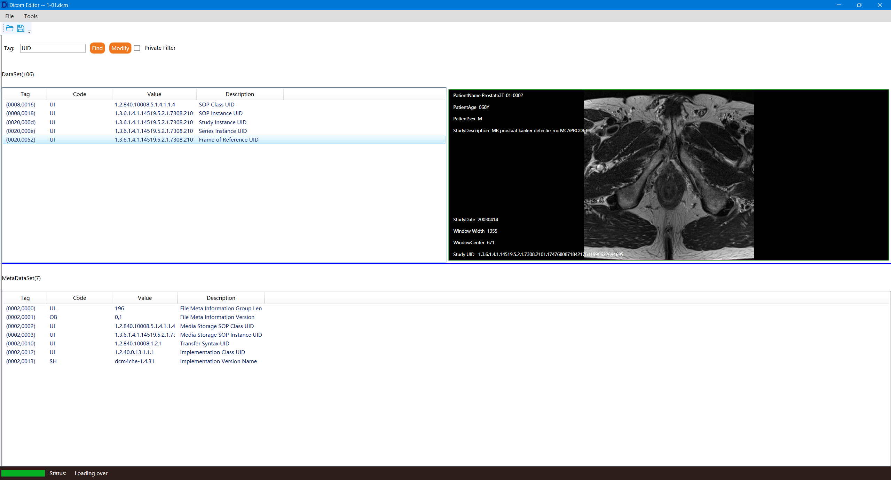
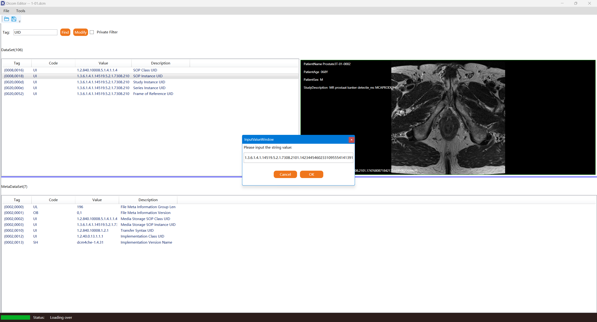
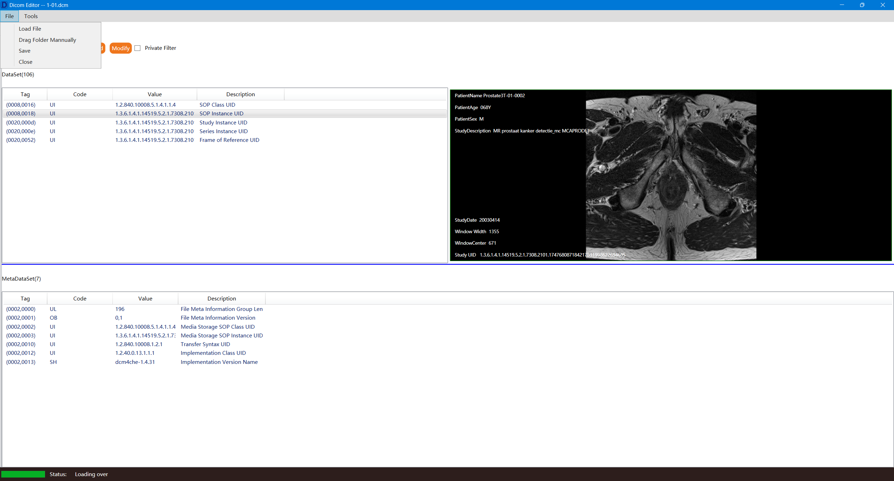
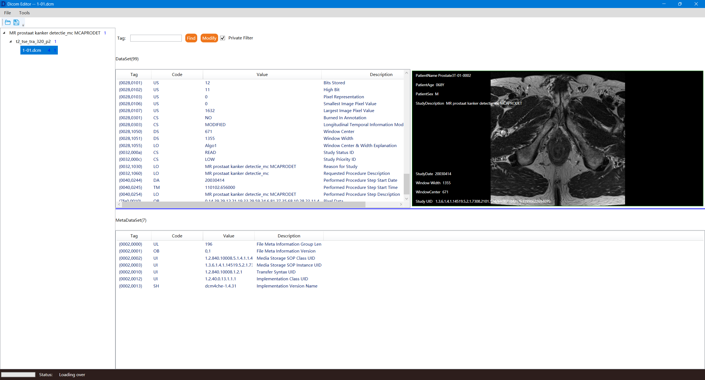

# DicomEditor

This is a simple tool used for dicom. 
I think it's helpful in some simple cases, and make sure not expect too much since I just took a few hours to do this.
You can drag a .dcm file or a folder to the page, and the program will display the tag information.
The program runs depending on .Net6.0 runtime.
The main feature is as following:

1. Open dcm file or folder by dragging into the window.
2. Query by tag or description.
3. Modify the tag value and save the changes.
4. Display the image of the instance and show some basic corner information.
5. Query all standard tags.

Open dcm file screenshot:

You can open dcm file by clicking menu command or drag the file to the window directly.

Query tags by tag or description:

Modify the tag values:

Save changes to file.

Open folder containing dcm files:

